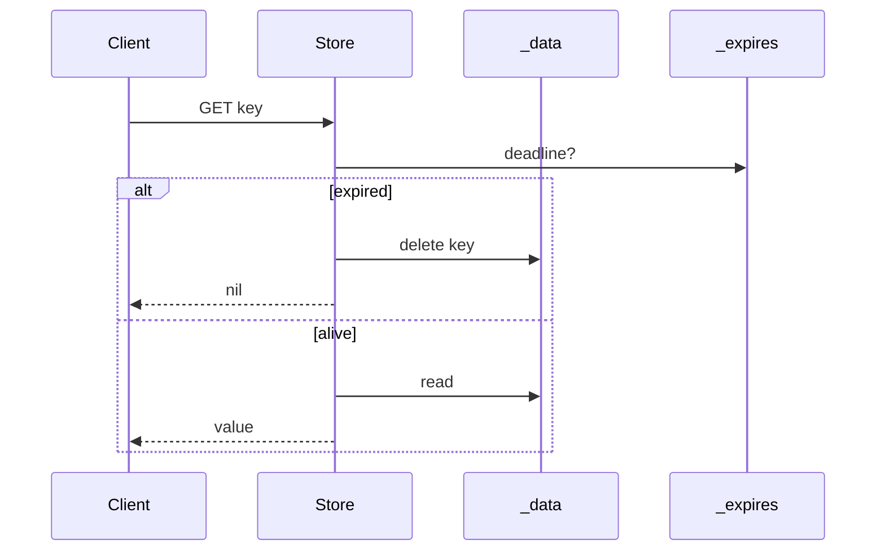

# Decisions (ADR leve)

Registre **por quê**, não só o quê. Um parágrafo + mermaid quando ajudar. Isso é ouro em code review e em entrevista.

---

## ADR-001 — Python + CLI, não C + TCP

**Status:** accepted  
**Contexto:** aula de projetos pessoais + estudo com AI; tempo limitado.  
**Decisão:** implementar MiniRedis em Python com REPL de texto.  
**Consequências:** fácil de ler e testar; não ensina event loop/RESP até o roadmap #12/#15.  
**Alternativas:** Go/Rust (mais “CV hard”), Redis module, wrapper em cima do redis-server.

---

## ADR-002 — Storage = `dict` + expires separados

**Status:** accepted  
**Contexto:** MVP precisa de SET/GET/TTL sem over-engineering.  
**Decisão:** `Store._data` e `Store._expires` como dicts separados; expire **lazy** no acesso.  
**Consequências:** chave expirada pode “viver” até alguém tocar nela (sem active expire).  
**Redis real:** active expire sampling + lazy delete + estruturas auxiliares para TTL.



---

## ADR-003 — KEYS com scan O(N)

**Status:** accepted (de propósito)  
**Contexto:** queremos uma feature “perigosa” para discutir complexidade na aula.  
**Decisão:** `KEYS` itera todas as chaves.  
**Consequências:** demo perfeita de por que Redis documenta “don’t use KEYS in production”.  
**Próximo passo:** roadmap `SCAN`.

---

## ADR-004 — Testes como sessões Redis

**Status:** accepted  
**Contexto:** accountability: qualquer um lê o teste e entende o comportamento.  
**Decisão:** `tests/test_commands.py` usa `run(store, "SET ...")` estilo transcript.  
**Consequências:** zero framework de DSL; pytest puro.

---

## Template para novas decisões

```markdown
## ADR-00X — Título

**Status:** proposed | accepted | superseded  
**Contexto:** …  
**Decisão:** …  
**Consequências:** …  
**Redis real:** …  
```
