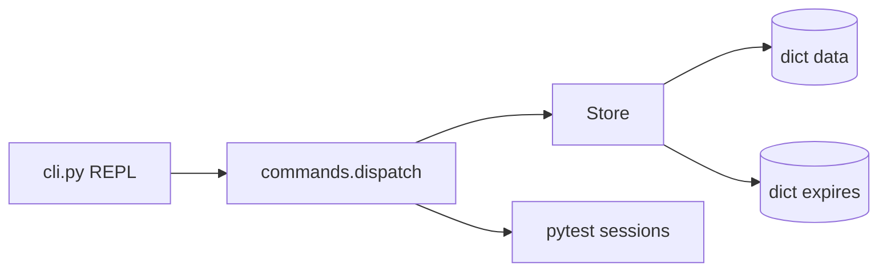

# Roadmap de features

Cada linha é uma entrega possível na aula ou em PRs depois. A coluna **Aprender** é o ângulo de estudo (o que perguntar ao modelo / o que escrever no CV).

| # | Feature | Status | Naive (agora) | Redis real | Aprender |
|---|---------|--------|---------------|------------|----------|
| 0 | CLI + `SET`/`GET`/`PING` | ✅ feito | `dict[str, str]` | hashtable + SDS / embstr | protocolo de comando, REPL, testes como spec |
| 1 | `DEL` / `EXISTS` / `DBSIZE` / `FLUSHDB` | ✅ feito | loops O(k) | mesmas ideias, API estável | arity, contratos de erro |
| 2 | `KEYS pattern` | ✅ feito | scan O(N) + glob simples | **não usar em prod**; `SCAN` cursor | por que O(N) dói; alternativa incremental |
| 3 | `EXPIRE` / `TTL` lazy | ✅ feito | deadline no dict, purge no acesso | active expire + lazy + heap/radix | trade-off precisão vs CPU |
| 4 | Tipos: listas (`LPUSH`/`RPUSH`/`LPOP`/`RPOP`/`LRANGE`) | ⬜ próximo | `list` Python | quicklist / listpack | polimorfismo de valor, `WRONGTYPE` |
| 5 | Hashes (`HSET`/`HGET`/`HGETALL`) | ⬜ | `dict` aninhado | ziplist/listpack → hashtable | encoding por tamanho |
| 6 | Sets (`SADD`/`SMEMBERS`/`SISMEMBER`) | ⬜ | `set` Python | intset / hashtable | membership O(1) vs lista |
| 7 | Sorted sets (`ZADD`/`ZRANGE`) | ⬜ | lista ordenada O(N log N) sort | skip list + dict | por que skip list |
| 8 | Persistência snapshot (`SAVE` → JSON/RDB toy) | ⬜ | dump JSON O(N) | RDB + AOF, fork/CoW | durabilidade vs latência |
| 9 | AOF toy (append log de comandos) | ⬜ | append linhas texto | AOF rewrite | replay, fsync policies |
| 10 | Pub/Sub (`SUBSCRIBE`/`PUBLISH`) | ⬜ | dict channel → callbacks | tipicamente outro caminho no server | fan-out, desacoplamento |
| 11 | Eviction (`MAXMEMORY` + LRU naive) | ⬜ | lista de acesso O(N) | approximate LRU / LFU | políticas sob pressão |
| 12 | Protocolo RESP + TCP server | ⬜ | linha de texto no CLI | RESP2/3 + event loop | I/O, framing, clientes reais |
| 13 | Transações (`MULTI`/`EXEC`) | ⬜ | fila de comandos | queue + WATCH/CAS | atomicidade otimista |
| 14 | `SCAN` cursor | ⬜ | índice inteiro no dict | cursor opaco | iteração sem bloquear |

## Como usar esta tabela

1. Escolha a próxima linha `⬜`.
2. Abra um issue/PR: `feat: LPUSH/LPOP (roadmap #4)`.
3. Peça ao agente (skill `teach-as-you-build`) o diagrama + complexidade **antes** do patch.
4. Atualize Status → ✅ e, se mudou um trade-off, acrescente em [DECISIONS.md](DECISIONS.md).

## Mapa mental (MVP atual)

